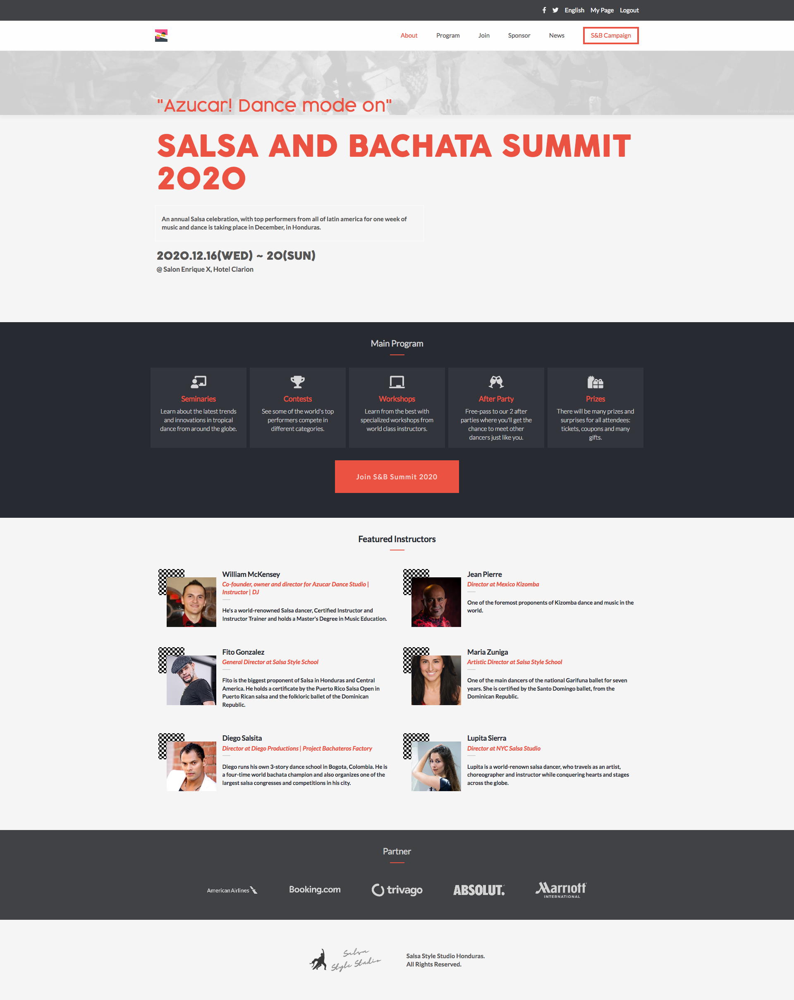

# Salsa & Bachata Summit 2020 - Microverse HTML & CSS Capstone Project

> This is a fully responsive website for an annual Salsa festival. Advanced CSS was used to build this website, such as CSS Grids, Flexbox, Bootsrap and SAAS.

This is the capstone project for Microverse's HTML & CSS module. The project is based on this website [CC-Global-Summit](https://www.behance.net/gallery/29845175/CC-Global-Summit-2015). 

The requirements of the project were the following:

-  build 3 pages as the minimum requirements:
    - the main page, with a menu link to the about page and tickets page
    - the about page
    - the tickets page
- the page should be responsive for 2 different screen sizes:
    - mobile: up to 768px
    - desktop: from 768px

The website was develped according to the client's specifications: color, typography, and layouts, which are found [here](https://www.behance.net/gallery/29845175/CC-Global-Summit-2015).

The goal of the project was to apply Advanced CSS techniques employing CSS Grids, Flexbox, gradients, background-images, Bootsrap and SAAS.

## Built With

- HTML
- CSS
- Bootstrap
- SAAS
- Github flow

## Live Demo

[Live Demo](https://starsheriff2.github.io/Salsa-Bachata-Summit-2020---HTML-CSS-Capstone-Project/)

## Author

👤 **Arturo Alvarez**

- GitHub: [@StarSheriff2](https://github.com/StarSheriff2)
- LinkedIn: [Arturo Alvarez](https://www.linkedin.com/in/arturoalvarezv/)
- Twitter: [@Turo_83](https://twitter.com/Turo_83)

## Contributing

Contributions, issues, and feature requests are welcome!

Feel free to check the [issues page](https://github.com/StarSheriff2/HTML-CSS-Capstone-Project/issues).

## Show your support

Give a ⭐️ if you like this project!

## 📝 License

- Design idea by [Cindy Shin in Behance](https://www.behance.net/adagio07)

- Font: Cocogoose Pro Family by Zetafonts -http://www.zetafonts.com/collection/308
